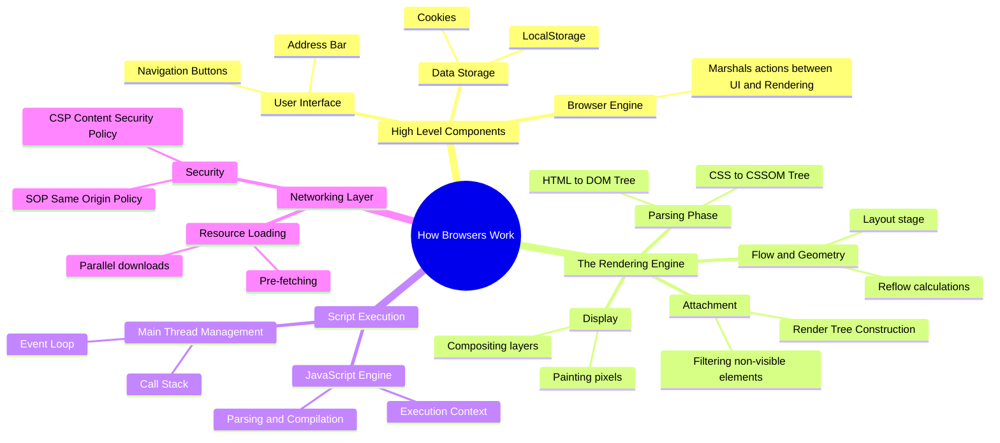

```mermaid
mindmap
  root((How Browsers Work))
    High Level Components
      User Interface
        Address Bar
        Navigation Buttons
      Browser Engine
        Marshals actions between UI and Rendering
      Data Storage
        LocalStorage
        Cookies
    The Rendering Engine
      Parsing Phase
        HTML to DOM Tree
        CSS to CSSOM Tree
      Attachment
        Render Tree Construction
        Filtering non-visible elements
      Flow and Geometry
        Layout stage
        Reflow calculations
      Display
        Painting pixels
        Compositing layers
    Script Execution
      JavaScript Engine
        Parsing and Compilation
        Execution Context
      Main Thread Management
        Event Loop
        Call Stack
    Networking Layer
      Resource Loading
        Pre-fetching
        Parallel downloads
      Security
        SOP Same Origin Policy
        CSP Content Security Policy
```
