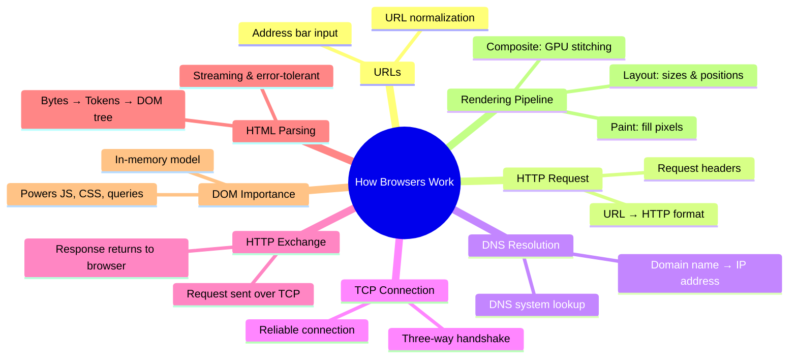

```mermaid
mindmap
  root((How Browsers Work))
    URLs
      Address bar input
      URL normalization
    HTTP Request
      URL → HTTP format
      Request headers
    DNS Resolution
      Domain name → IP address
      DNS system lookup
    TCP Connection
      Three-way handshake
      Reliable connection
    HTTP Exchange
      Request sent over TCP
      Response returns to browser
    HTML Parsing
      Bytes → Tokens → DOM tree
      Streaming & error-tolerant
    DOM Importance
      In-memory model
      Powers JS, CSS, queries
    Rendering Pipeline
      Layout: sizes & positions
      Paint: fill pixels
      Composite: GPU stitching
```
