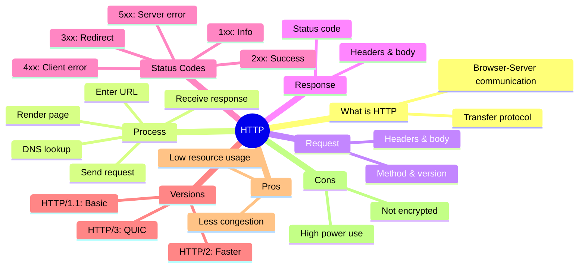

```mermaid
mindmap
  root((HTTP))
    What is HTTP
      Browser-Server communication
      Transfer protocol
    Process
      Enter URL
      DNS lookup
      Send request
      Receive response
      Render page
    Request
      Method & version
      Headers & body
    Response
      Status code
      Headers & body
    Status Codes
      1xx: Info
      2xx: Success
      3xx: Redirect
      4xx: Client error
      5xx: Server error
    Versions
      HTTP/1.1: Basic
      HTTP/2: Faster
      HTTP/3: QUIC
    Pros
      Low resource usage
      Less congestion
    Cons
      Not encrypted
      High power use
```
