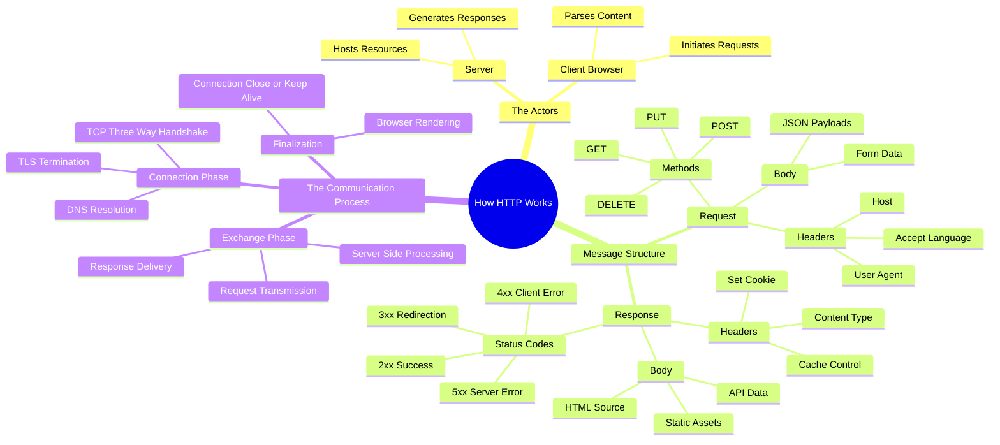

```mermaid
mindmap
  root((How HTTP Works))
    The Actors
      Client Browser
        Initiates Requests
        Parses Content
      Server
        Hosts Resources
        Generates Responses
    Message Structure
      Request
        Methods
          GET
          POST
          PUT
          DELETE
        Headers
          User Agent
          Accept Language
          Host
        Body
          Form Data
          JSON Payloads
      Response
        Status Codes
          2xx Success
          3xx Redirection
          4xx Client Error
          5xx Server Error
        Headers
          Content Type
          Cache Control
          Set Cookie
        Body
          HTML Source
          Static Assets
          API Data
    The Communication Process
      Connection Phase
        DNS Resolution
        TCP Three Way Handshake
        TLS Termination
      Exchange Phase
        Request Transmission
        Server Side Processing
        Response Delivery
      Finalization
        Connection Close or Keep Alive
        Browser Rendering
```
